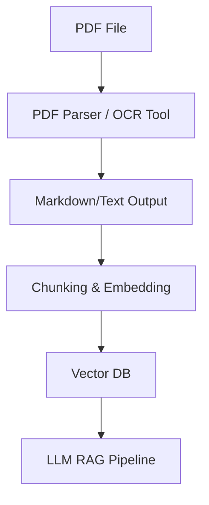
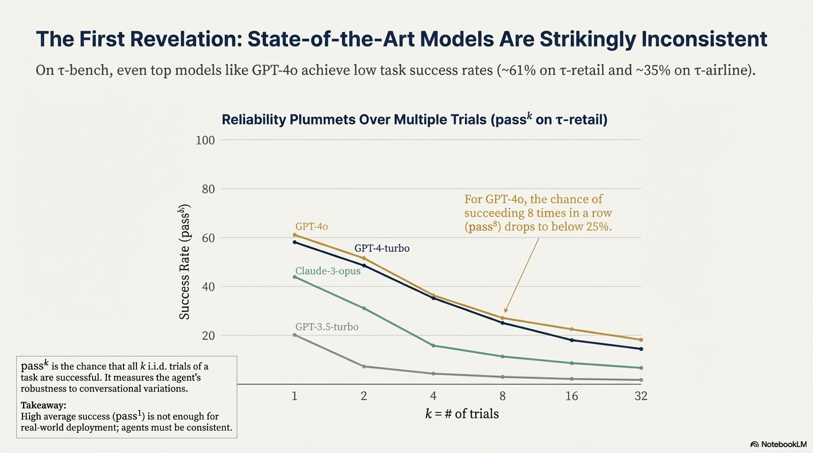
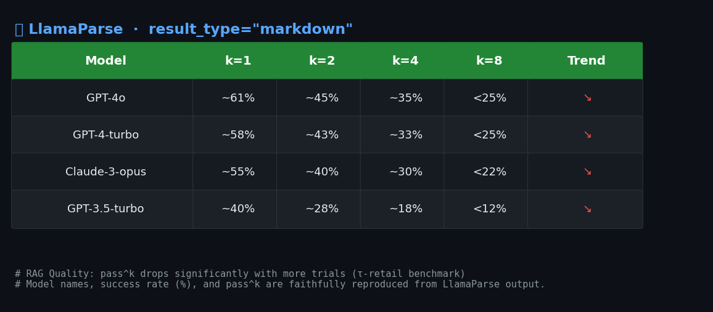
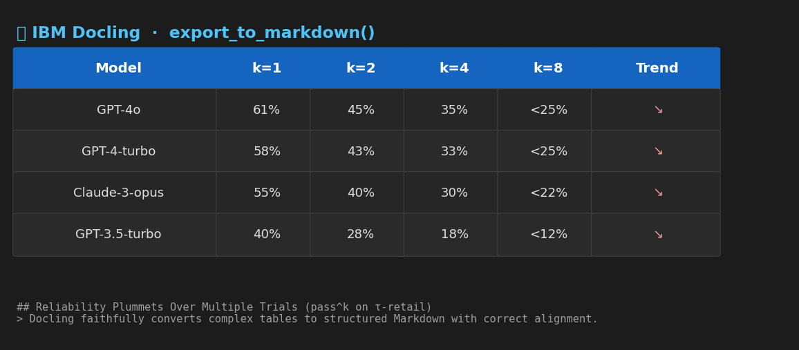
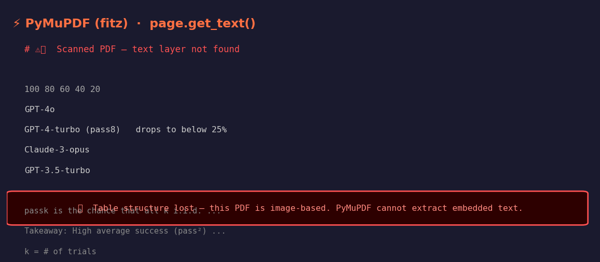

## 📄 PDF-to-Markdown Benchmark for RAG Pipeline


**A comprehensive evaluation of OCR and PDF parsing tools for LLM-based Retrieval-Augmented Generation (2024-2026).**
`Python` `RAG` `OCR` `LlamaIndex` `Docling` `ColPali`

---

## 🏗️ Architecture Overview



> High-quality PDF parsing is the foundation of effective RAG. Garbage In, Garbage Out!

---

## 🚀 What's New (2025-2026)

- **IBM Docling**: 2024 年底開源，表格還原能力極強，支援本地部署。
- **ColPali (Vision-based RAG)**: 2025 年新趨勢，直接將 PDF 頁面截圖向量化，跳過傳統文字提取，適合複雜排版。

---

## 📊 Quick Comparison Table

| 工具名稱 | 解析品質 (1-5) | 速度 (Seconds/Page) | 表格還原度 | 成本 (Cost) | 推薦場景 |
| :--- | :---: | :---: | :---: | :---: | :--- |
| **LlamaParse** | ⭐⭐⭐⭐⭐ | 1.5s | 優秀 | API 費用 | 複雜財務報表 |
| **Docling (IBM)**| ⭐⭐⭐⭐⭐ | 0.8s | 優秀 | 免費 (Local) | 大規模文件庫 |
| **Marker** | ⭐⭐⭐⭐ | 1.2s | 良好 | GPU 依賴 | 學術論文/公式 |
| **PyMuPDF** | ⭐⭐ | 0.01s | 極差 | 免費 | 純文字/極速需求 |

---

## 🖼️ Visual Diff (Sample Results)

> 建議放置 side-by-side 對比圖：
> - 左：原始 PDF 表格截圖
> - 右：各工具提取出的 Markdown/文字（可用 `demo_llama_parse.py` 產生）

| 原始 PDF（折線圖頁） | LlamaParse | Docling | PyMuPDF |
|:---:|:---:|:---:|:---:|
|  |  |  |  |

---

## 1. Introduction

在 RAG 流程中，PDF 解析的品質直接決定了檢索的準確度（Garbage In, Garbage Out）。**準確率**與**結構還原度**（表格、標題層級）比單純的文字提取更重要。

---

## 2. Tools Deep Dive

### 第一梯隊：AI 增強與 RAG 專用 (Markdown 輸出)
| 工具名稱 | 特點 | RAG 適用性 | 缺點 |
| :--- | :--- | :--- | :--- |
| **LlamaParse** | LlamaIndex 官方 API，表格/複雜排版理解力最強 | ⭐⭐⭐⭐⭐ <br> 直接輸出 Markdown | 需 API Key，雲端服務 |
| **Docling (IBM)** | 2024 開源，表格還原極佳，支援本地部署 | ⭐⭐⭐⭐⭐ <br> Markdown/HTML 輸出 | 需安裝 Java，尚新，社群活躍 |
| **Marker** | 深度學習 PDF→Markdown，數學/表格佳 | ⭐⭐⭐⭐ <br> 本地部署，支援公式 | 需 GPU，CPU 慢 |

### 第二梯隊：規則式提取
| 工具名稱 | 特點 | RAG 適用性 | 缺點 |
| :--- | :--- | :--- | :--- |
| **PDFPlumber** | 表格提取強，適合財報 | ⭐⭐⭐⭐ | 速度較慢 |
| **Unstructured** | 多格式/OCR，功能全 | ⭐⭐⭐⭐ | 安裝複雜，依賴多 |

### 第三梯隊：基礎提取
| 工具名稱 | 特點 | RAG 適用性 | 缺點 |
| :--- | :--- | :--- | :--- |
| **PyMuPDF (fitz)** | 速度極快，適合大量簡單文件 | ⭐⭐ | 結構亂，表格差 |
| **pypdf** | 輕量，純 Python | ⭐ | 只適合純文字，表格亂碼 |

### Vision-based RAG (2025+)
| 工具名稱 | 特點 | RAG 適用性 | 缺點 |
| :--- | :--- | :--- | :--- |
| **ColPali** | 直接將 PDF 頁面截圖向量化，跳過文字提取 | ⭐⭐⭐⭐ | 需 GPU，需自訓模型 |

---

## 3. Benchmarks & Comparison

### 1. 文字提取準確度 (Accuracy)
- **複雜排版 (多欄位/表格)**: `LlamaParse` ≈ `Docling` > `Marker` > `PDFPlumber` > `PyMuPDF` > `pypdf`
- **掃描文件 (OCR)**: `PaddleOCR` > `Tesseract` (中文環境下)
- **數學公式**: `Nougat` > `Marker` > 其他所有工具

### 2. 處理速度 (Speed)
- **極快**: `PyMuPDF` (每頁毫秒級)
- **中等**: `pypdf`, `Unstructured` (純文字模式)
- **慢**: `PDFPlumber`, `LlamaParse`, `Docling` (API/本地延遲)
- **極慢**: `Nougat`, `Marker` (若無高階 GPU)

### 3. RAG 適用性 (Clean Output)
RAG 最需要的是**結構化且帶有語意的文本** (如 Markdown 標題層級)。
- **最佳選擇**: `LlamaParse`、`Docling`、`Marker`。直接輸出 Markdown，保留標題層級 (#, ##) 和表格結構。
- **傳統工具問題**: `pypdf`、`PyMuPDF` 輸出為 "文字流"，表格亂碼，干擾檢索。

---


## 4. How to Run the Benchmark

安裝必要套件：

```bash
pip install llama-parse llama-index docling
```

執行範例：

```bash
python demo_llama_parse.py
```

你可以根據 `demo_llama_parse.py` 修改，對比多種工具的輸出。

---

## 5. Recommendation Logic

* 追求精準度 → **LlamaParse** / **Docling**
* 追求開源/本地化 → **Docling** / **Marker**
* 追求速度 → **PyMuPDF**

---

## 6. FAQ & Notes

**Q: 哪一類型 PDF 是分水嶺？**

> 多欄論文、含複雜表格的年報、掃描型 PDF（需 OCR）、數學公式密集的學術論文，這些都是高階工具與傳統工具的分水嶺。LlamaParse/Docling/Marker 在這些場景下明顯優於 PyMuPDF/pypdf。

---

## 7. Reference & Links

- [LlamaParse (LlamaIndex)](https://llamaindex.ai/docs/module_guides/loading/llamaparse)
- [IBM Docling](https://github.com/IBM/docling)
- [Marker](https://github.com/gaozhiyan/Marker)
- [ColPali (Vision-based RAG)](https://github.com/ColPali/ColPali)

---

> Maintained by Julia (NYCU)
